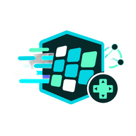

  

# Language Runtime Roadmap

ByteMsg233 treats each target language as a real product surface, not a checkbox. Generated files should be easy to read, easy to extend, and safe to regenerate.

## Official Repositories

| Language | Repository | Status | Primary users |
|---|---|---|---|
| Go | https://github.com/neko233-com/bytemsg233-go | active | server, tooling, gateways |
| C# / Unity | https://github.com/neko233-com/bytemsg233-csharp | active | Unity client, .NET tools |
| TypeScript / JavaScript | https://github.com/neko233-com/bytemsg233-typescript | active | web, frontend tooling, Node.js |
| Java / Android | https://github.com/neko233-com/bytemsg233-java | active | Android, JVM backend |
| Rust | https://github.com/neko233-com/bytemsg233-rust | active | high-performance clients and services |
| C++ | https://github.com/neko233-com/bytemsg233-cpp | planned | native clients, engines, tools |
| C | https://github.com/neko233-com/bytemsg233-c | planned | embedded, FFI, minimum runtime hosts |
| Kotlin | https://github.com/neko233-com/bytemsg233-kotlin | planned | Android/KMP |
| Swift | https://github.com/neko233-com/bytemsg233-swift | planned | iOS/macOS |
| Dart / Flutter | https://github.com/neko233-com/bytemsg233-dart | planned | Flutter clients |
| Lua | https://github.com/neko233-com/bytemsg233-lua | planned | scripting, game runtime glue |
| Python | in main repo for now | supported | tools, tests, build pipelines |

## Required API Shape

Every target must support normal allocation and pool usage:

| Language | Normal allocation | Pool hot path | Extension surface |
|---|---|---|---|
| Go | `&Hero{}` | `AcquireHero()` / `ReleaseHero(hero)` | methods in same package |
| C# / Unity | `new Hero()` | `Hero.Prewarm()` / `Hero.Rent()` / `hero.Release()` | `partial class` |
| TypeScript | `new Hero()` | `Hero.acquire()` / `hero.release()` | declaration merging / helpers |
| Java | `new Hero()` | `Hero.acquire()` / `hero.release()` | helper hooks / companion classes |
| Rust | `Hero::default()` | `ByteMsgPool<Hero>` | extension traits |
| C++ | `Hero{}` / `std::make_unique<Hero>()` | arena or object pool rent/return | free functions / wrapper types |
| C | stack struct / init function | caller-owned pool/context | opaque context hooks |
| Kotlin | `Hero()` | companion `prewarm/acquire/release` | extension functions |
| Swift | `Hero()` | pool object / static rent-return | extension methods |
| Dart | `Hero()` | `Hero.acquire()` / `release()` | extension methods |
| Lua | table constructor | table pool acquire/release | metatable-safe helpers |
| Python | `Hero()` | `Hero.acquire()` / `release()` | mixins / sidecar helpers |

Hot-path encode/decode must prefer caller-provided buffers and reusable decoder state. Pretty string and debug helpers may allocate, but they must stay outside the hot path.

Target language runtimes and generated encode/decode code are single-threaded. Pool helpers must use plain stack/list/arena storage owned by the caller or runtime instance. Do not add locks, concurrent collections, channels, goroutines, atomics, thread pools, or background workers to runtime hot paths.

## Export Names

Single-file exports default to `ByteMsg233_Export` plus the target extension:

| Language | Default file |
|---|---|
| Go | `ByteMsg233_Export.go` |
| C# | `ByteMsg233_Export.cs` |
| TypeScript | `ByteMsg233_Export.ts` |
| Rust | `ByteMsg233_Export.rs` |
| C++ | `ByteMsg233_Export.hpp` / `ByteMsg233_Export.cpp` |
| C | `ByteMsg233_Export.h` / `ByteMsg233_Export.c` |
| Kotlin | `ByteMsg233_Export.kt` |
| Swift | `ByteMsg233_Export.swift` |
| Dart | `ByteMsg233_Export.dart` |
| Lua | `ByteMsg233_Export.lua` |
| Python | `ByteMsg233_Export.py` |

Java may keep per-type file names because public class names and file names must match.

## Implementation Order

1. Keep Go, C# / Unity, TypeScript, Java, Rust stable.
2. Add C++ and C runtimes next because they cover native engines, FFI, and embedded hosts.
3. Add Kotlin and Swift for mobile-first clients.
4. Add Dart / Flutter and Lua for common game/application scripting surfaces.
5. Keep Python useful for tools even if it is not a zero-GC runtime target.
